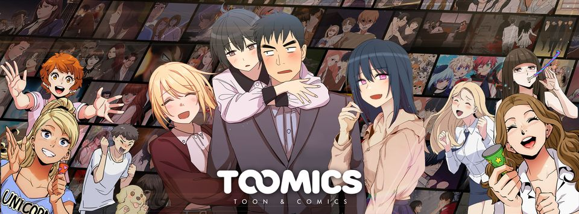

Toomics - WebScraping Project
==============================

Introduction
------------

Toomics is a premium subscription webtoon service with exclusive titles from professional artists. Following the other webscraping projects, as Tapas and Anime-Planet, this projects aims to scrape the webtoons available on [Toomics](https://toomics.com/). The data will be stored on a CSV file, and available on GitHub and Kaggle for research purposes.

> **Disclaimer:** This is a personal project to practice webscraping skills and exploratory data analysis. I do not recommend to use for other purposes. Use it at your own risk.

Data Description
----------------

#### `data.csv`

| variable | class   | description                                             |
| :--------| :------ | :------------------------------------------------------ |
| title    | string  | Name of the webtoon                                     |
| episodes | integer | Number of episodes                                      |
| writers  | list    | Webtoon writers and artists                             |
| genres   | list    | Genres of the webtoon                                   |
| badges   | list    | Badges of the webtoon                                   |
| link     | string  | Link to webtoon page on [Toomics](https://toomics.com/) |
| cover    | string  | Link to webtoon cover                                   |
 

Licence
-------
Copyright (c) 2022 Victor Soeiro

This project is licensed under the MIT License

Contact
-------
If you have any questions or suggestions, send me an email to victor.soeiro.araujo@gmail.com
